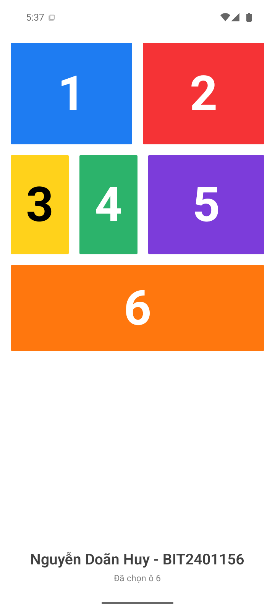

# Bt_01 - Giao diện ứng dụng di động

Sinh viên: **Nguyễn Doãn Huy - BIT240115**

Ứng dụng React Native/Expo hiển thị sáu ô màu theo đề bài. Chạm vào một ô để xem số đã chọn.



## Video thuyết minh

[Xem video trình bày và giải thích bài tập](video-giai-thich-bt01.mp4)

## Chạy ứng dụng

```bash
npm install
npm start
```

Mở bằng Expo Go trên điện thoại, hoặc nhấn `a` trong terminal để chạy trên Android Emulator.
