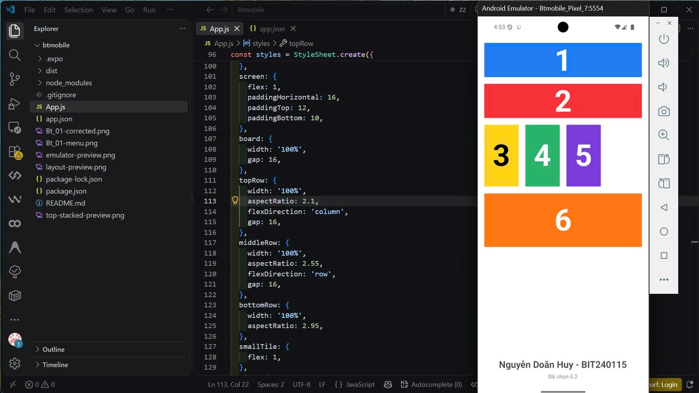

# Bt_01 - Bài tập làm thêm

Sinh viên: **Nguyễn Doãn Huy - BIT240115**

Biến thể của Bt_01: ô 1 và 2 xếp dọc, mỗi ô chiếm toàn bộ chiều ngang. Ô 3, 4 và 5 có cùng chiều rộng, bên phải để trống. Chạm vào ô số để hiển thị số đã chọn.

## Ảnh bài làm



[Xem ảnh giao diện trực tiếp từ Android Emulator](giao-dien.png)

## Chạy ứng dụng

```bash
npm install
npm start
```

Mở bằng Expo Go trên điện thoại hoặc nhấn `a` trong terminal để chạy trên Android Emulator.
