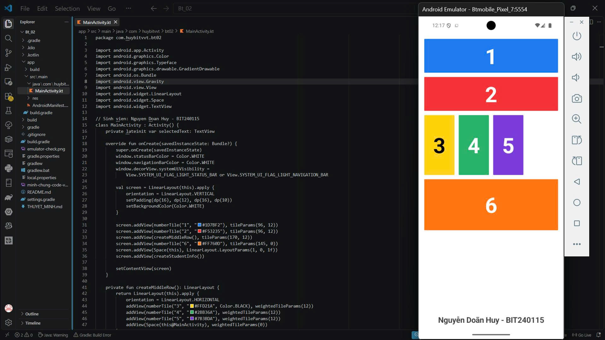

# Bt_02 - Android Native (Kotlin)

Sinh viên: **Nguyễn Doãn Huy - BIT240115**

Bài tập xây dựng giao diện 6 khối màu bằng Android Native và Kotlin theo yêu cầu đổi công nghệ so với Bài 1 (Bài 1 sử dụng React Native).

## Đề bài

## Cấu trúc giao diện

- **Tổng thể:** Sử dụng LinearLayout chiều dọc (VERTICAL) bao trọn màn hình.
- **Ô 1 và 2:** Xếp dọc, chiếm toàn bộ bề ngang (MATCH_PARENT), lần lượt có màu xanh dương (#1D7BF2) và đỏ (#F53235).
- **Hàng giữa:** Sử dụng LinearLayout chiều ngang (HORIZONTAL), chia làm 4 phần bằng nhau (layout_weight = 1):
  - Ô 3: Màu vàng (#FFD21A), chữ đen.
  - Ô 4: Màu xanh lá (#2BB36A), chữ trắng.
  - Ô 5: Màu tím (#7B3BDA), chữ trắng.
  - Phần thứ tư: Một Space rỗng tạo khoảng trống bên phải theo đúng đề bài.
- **Ô 6:** Màu cam (#FF760D), chiếm toàn bộ bề ngang màn hình.
- **Tương tác:** Chạm vào bất kỳ ô số nào sẽ có hiệu ứng phản hồi và hiển thị dòng chữ *"Đã chọn ô [Số]"* ở phía dưới.
- **Thông tin sinh viên:** Hiển thị rõ ràng tên và MSV Nguyễn Doãn Huy - BIT240115.

## Tài liệu thuyết minh & Thuyết trình video

- Kịch bản đọc và hướng dẫn chi tiết khi quay video: [THUYET_MINH.md](THUYET_MINH.md)

## Cách chạy ứng dụng

`powershell
$env:JAVA_HOME = 'E:\Java\temurin-21\jdk-21.0.12.1+1'
.\gradlew.bat installDebug
`

Ảnh minh chứng code và máy ảo: minh-chung-code-va-may-ao.png.
